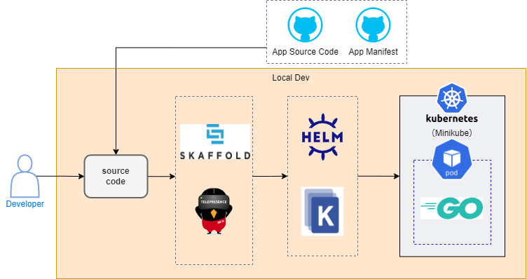

# nautible-app-examples (Golang) Project
このドキュメントには最低限の動作を確認するための、サンプルアプリケーションについて記載する。

## アプリケーションの主要アーキテクチャ
* [Golang](https://go.dev/)
* REST
* [Kubernetes](https://kubernetes.io/)
* [Docker](https://www.docker.com/)
* [AWS](https://aws.amazon.com/)
* [Azure](https://azure.microsoft.com/)

## Examplesサービスが利用するリソースとローカル環境での代替
### AWS
|  開発環境(AWS)  |  ローカル環境  | 備考 |
| ---- | ---- | ---- |
| ECR  | -    |      |

### Azure
|  開発環境(Azure)  |  ローカル環境  | 備考 |
| ---- | ---- | ---- |
| ACR  | -    |      |

## ディレクトリ構成
[Standard Go Project Layout](https://github.com/golang-standards/project-layout/blob/master/README_ja.md)を参考に構成


## ローカル環境での開発方法
### ローカル開発イメージ図


### 事前準備
* [dockerのインストール](https://docs.docker.com/get-docker/)
* [minikubeのインストール](https://kubernetes.io/ja/docs/tasks/tools/install-minikube/)
* [kubectlのインストール](https://kubernetes.io/ja/docs/tasks/tools/install-kubectl/)（接続先の設定をminikubeにする）
* [skaffoldのインストール](https://skaffold.dev/docs/install/)
* マニフェストファイルの配置
  [nautible-app-examples-manifest](https://github.com/nautible/nautible-app-examples-manifest)をnautible-app-examplesプロジェクトと同一階層に配置する(git clone)。

### 実行
- OpenAPI定義参照
  - 例) hello
    - http://localhost:8080/examples/hello

### skaffoldによるアプリケーション起動

```bash
skaffold dev --profile=(aws|azure) --port-forward --filename=./scripts/skaffold.yaml
```
※wslなどのLinux環境で実行することを前提としています

## （参考）アプリケーション構築時の手順
### Golangバージョン
1.18

### OpenAPI
- oapi-codegenを導入
```bash
go get github.com/deepmap/oapi-codegen/cmd/oapi-codegen@v1.9.0
```

- YAMLファイルを準備
  - 参考：api/内のYAMLファイル

- サーバーコード生成
```bash
oapi-codegen -package examplesserver -generate "types" -o pkg/generate/examplesserver/types.go api/examples.yaml
oapi-codegen -package examplesserver -generate "chi-server" -o pkg/generate/examplesserver/server.go api/examples.yaml
oapi-codegen -package examplesserver -generate "spec" -o pkg/generate/examplesserver/spec.go api/examples.yaml
```

### go mod
```bash
go mod init github.com/nautible/nautible-app-examples
go mod tidy
```
