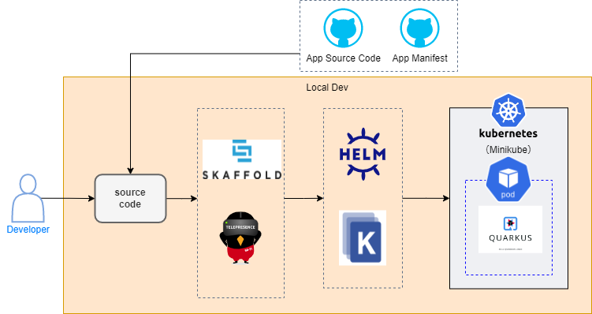

# nautible-app-examples (java) Project

このドキュメントには最低限の動作を確認するための、サンプルアプリケーションについて記載する。
Quarkus アプリケーション共通の内容については[こちら](https://github.com/nautible/docs/quarkus/README.md)を参照。

## アプリケーションの主要アーキテクチャ

- [Java11](https://www.oracle.com/java/)
- [Quarkus](https://quarkus.io/)
- [Maven](https://maven.apache.org/)
- REST
- [Kubernetes](https://kubernetes.io/)
- [Docker](https://www.docker.com/)
- [AWS](https://aws.amazon.com/)
- [Azure](https://azure.microsoft.com/)

## Examples サービスが利用するリソースとローカル環境での代替

### AWS

| 開発環境(AWS) | ローカル環境 | 備考 |
| ------------- | ------------ | ---- |
| ECR           | -            |      |

### Azure

| 開発環境(Azure) | ローカル環境 | 備考 |
| --------------- | ------------ | ---- |
| ACR             | -            |      |

## ローカル環境での開発方法

### ローカル開発イメージ図



### 事前準備

- [docker のインストール](https://docs.docker.com/get-docker/)
- [minikube のインストール](https://kubernetes.io/ja/docs/tasks/tools/install-minikube/)
- [kubectl のインストール](https://kubernetes.io/ja/docs/tasks/tools/install-kubectl/)（接続先の設定を minikube にする）
- [skaffold のインストール](https://skaffold.dev/docs/install/)
- マニフェストファイルの配置
  [nautible-app-examples-manifest](https://github.com/nautible/nautible-app-examples-manifest)を nautible-app-examples プロジェクトと同一階層に配置する(git clone)。

### 実行

- OpenAPI 定義参照
  - 例) hello
    - http://localhost:8080/examples/hello

### skaffold によるアプリケーション起動

```bash
skaffold dev --profile=(aws|azure) --port-forward
```

※wsl などの Linux 環境で実行することを前提としています
