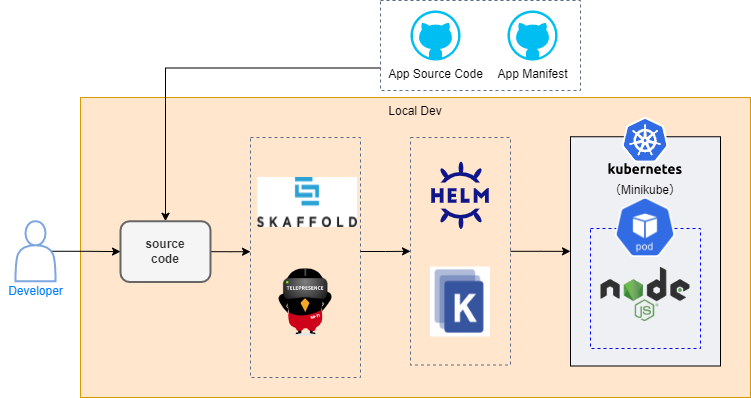

# nautible-app-examples (Node.js) Project
このドキュメントには最低限の動作を確認するための、サンプルアプリケーションについて記載する。  

## アプリケーションの主要アーキテクチャ
* [Node.js](https://nodejs.org/ja/)
* REST
* [Kubernetes](https://kubernetes.io/)
* [Docker](https://www.docker.com/)
* [AWS](https://aws.amazon.com/)

## Examplesサービスが利用するAWSリソースとローカル環境での代替
|  開発環境(AWS)  |  ローカル環境  | 備考 |
| ---- | ---- | ---- |
| ECR  | -    |      |

## ローカル環境での開発方法
### ローカル開発イメージ図


### 事前準備
* [dockerのインストール](https://docs.docker.com/get-docker/)
* [minikubeのインストール](https://kubernetes.io/ja/docs/tasks/tools/install-minikube/)
* [kubectlのインストール](https://kubernetes.io/ja/docs/tasks/tools/install-kubectl/)（接続先の設定をminikubeにする）
* [skaffoldのインストール](https://skaffold.dev/docs/install/)
* マニフェストファイルの配置
  [nautible-app-examples-manifest](https://github.com/nautible/nautible-app-examples-manifest)をnautible-app-examplesプロジェクトと同一階層に配置する(git clone)。

### 実行
- OpenAPI定義参照
  - 例) hello
    - http://localhost:8080/examples/hello

### skaffoldによるアプリケーション起動

```bash
skaffold dev --profile=(aws) --port-forward
```
※wslなどのLinux環境で実行することを前提としています

## （参考）アプリケーション構築時の手順
### Node.jsバージョン
v18.12.0

### OpenAPI
- [OpenAPI Generator Plus CLI](https://github.com/karlvr/openapi-generator-plus)を導入
```bash
npm install openapi-generator-plus@2.3.1 -g
```

- プロジェクト生成
```bash
npm init openapi-generator-plus nautible-app-examples-node
※コマンド実行後「Server」「typescript-express-passport-server」を選択する
npm install
```

- YAMLファイルを準備
  - 参考：api/内のYAMLファイル

- コード生成
```bash
npx openapi-generator-plus -g @openapi-generator-plus/typescript-express-passport-server-generator -o src/openapi_server/examples api/examples.yaml
```
